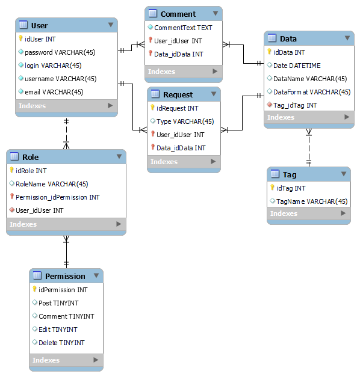

# Проєктування бази даних

## Модель бізнес-об'єктів

@startuml
entity User <<ENTITY>> #003aeb
entity User.password <<TEXT>>
entity User.login <<TEXT>>
entity User.username <<TEXT>>
entity User.email <<TEXT>>
entity User.id <<NUMBER>>

User *-u- User.password
User *-u- User.login
User *-u- User.username
User *-d- User.email
User *-d- User.id

entity Data <<ENTITY>> #003aeb
entity Data.date <<DATETIME>>
entity Data.id <<NUMBER>>
entity Data.name <<TEXT>>
entity Data.format <<TEXT>>

Data *-d- Data.date
Data *-d- Data.id
Data *-d- Data.name
Data *-d- Data.format

entity Role <<ENTITY>> #003aeb
entity Role.id <<NUMBER>>
entity Role.name <<TEXT>>

Role *-u- Role.id
Role *-u- Role.name

entity Request <<ENTITY>> #003aeb
entity Request.id <<NUMBER>>
entity Request.type <<NUMBER>>

Request *-u- Request.id
Request *-u- Request.type

entity Permission <<ENTITY>> #003aeb
entity Permission.comment <<BOOL>> 
entity Permission.post <<BOOL>> 
entity Permission.edit <<BOOL>> 
entity Permission.delete <<BOOL>> 

Permission *-- Permission.comment
Permission *-- Permission.post
Permission *-- Permission.edit
Permission *-- Permission.delete

entity Comment <<ENTITY>> #003aeb
entity Comment.text <<TEXT>> 
Comment *-- Comment.text

entity Tag <<ENTITY>> #003aeb
entity Tag.id <<NUMBER>>
entity Tag.name <<TEXT>>

Tag *-r- Tag.id
Tag *-r- Tag.name

User "1,1"-r-"0,*" Request
User "1,1"-r-"0,*" Comment
User "0,*"-l-"1,1" Role

Role "1,1*"--"0,*" Permission

Data "1,1"-l-"0,*" Comment
Data "0,*"-r-"1,1" Tag
Data "0,*"-l-"1,1" Request

@enduml

## ER-модель

@startuml
entity User <<ENTITY>> #ffedba {
  password: TEXT
  login: TEXT
  username: TEXT
  email: TEXT
  id: NUMBER
}

entity Data <<ENTITY>> #ffedba {
  date: DATETIME
  id: NUMBER
  name: TEXT
  format: TEXT
}

entity Role <<ENTITY>> #ffedba {
  id: NUMBER
  name: TEXT
}

entity Request <<ENTITY>> #ffedba {
  id: NUMBER
  type: NUMBER
}

entity Permission <<ENTITY>> #ffedba {
  comment: BOOL
  post: BOOL
  edit: BOOL
  delete: BOOL
}

entity Comment <<ENTITY>> #ffedba {
  text: TEXT
}

entity Tag <<ENTITY>> #ffedba {
  id: NUMBER
  name: TEXT
}

User "1,1" -r- "0,*" Request
User "1,1" -- "0,*" Comment
User "0,*" -- "1,1" Role

Role "1,1" -- "0,*" Permission

Data "1,1" -- "0,*" Comment
Data "1,1" -l- "0,*" Request
Data "0,*" -- "1,1" Tag

@enduml

## Реляційна схемa

