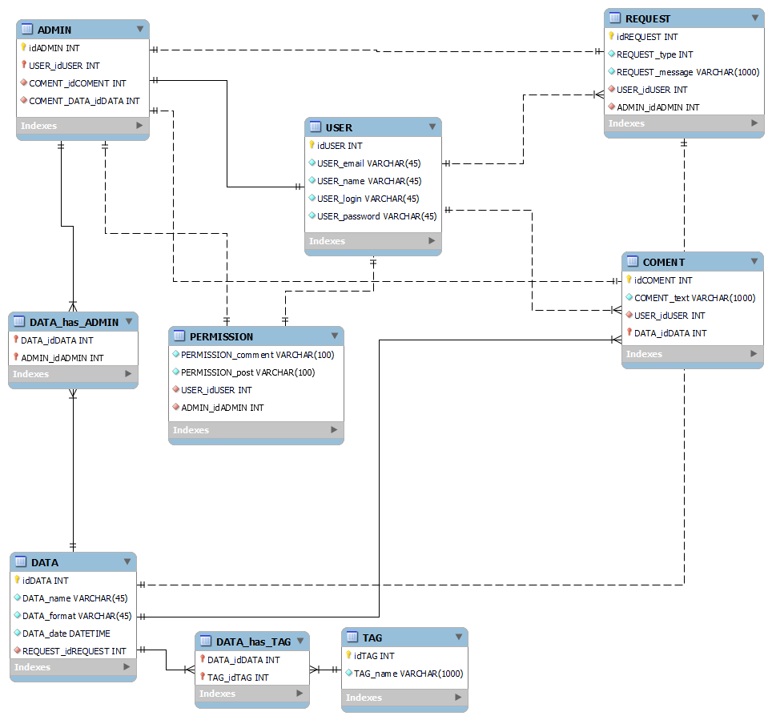

# Проєктування бази даних

## Модель бізнес-об'єктів

@startuml
    entity User <<ENTITY>> #003aeb
    entity User.password <<TEXT>>
    entity User.login <<TEXT>>
    entity User.username <<TEXT>>
	entity User.email <<TEXT>>
    entity User.id <<NUMBER>>
	
    User *-u- User.password
	User *-u- User.login
	User *-u- User.username
	User *-r- User.email
	User *-r- User.id
    
	
	entity Data <<ENTITY>> #003aeb
	entity Data.date <<DATETIME>>
	entity Data.id <<NUMBER>>
	entity Data.name <<TEXT>>
	entity Data.format <<TEXT>>
	
	Data *-l- Data.date
	Data *-l- Data.id
	Data *-d- Data.name
	Data *-d- Data.format
	
	
	entity Admin <<ENTITY>> #003aeb
	Admin -r-|> User
	
	
	entity Request <<ENTITY>> #003aeb
	entity Request.id <<NUMBER>>
    entity Request.type <<NUMBER>>
    entity Request.message <<TEXT>>
	
	Request *-- Request.id
    Request *-- Request.type
    Request *-- Request.message
	
	
	entity Permission <<ENTITY>> #003aeb
	entity Permission.comment <<BOOL>> 
	entity Permission.post <<BOOL>> 
	
	Permission *-- Permission.comment
    Permission *-- Permission.post
	
	
	entity Comment <<ENTITY>> #003aeb
	entity Comment.text <<TEXT>> 
	Comment *-u- Comment.text
	
	
	entity Tag <<ENTITY>> #003aeb
    entity Tag.id <<NUMBER>>
    entity Tag.name <<TEXT>>
	
	Tag *-u- Tag.id
    Tag *-u- Tag.name
	
	
	User "1,1"--"0,*" Request
	User "1,1"--"0,*" Comment
	User "1,1"--"1,1" Permission
	
	Data "0,*"-r-"0,*" Admin
	Data "1,1"-r-"0,*" Comment
	Data "1,1"--"1,1" Request
	Data "0,*"-u-"0,*" Tag
	
	Admin "0,*"--"0,*" Permission
	Admin "0,*"--"0,*" Request
	Admin "0,*"-l-"0,*" Comment

@enduml

## ER-модель

@startuml
entity User <<ENTITY>> #ffedba {
    password: TEXT
    login: TEXT
    username: TEXT
    email: TEXT
    id: NUMBER
}

entity Data <<ENTITY>> #ffedba {
    date: DATETIME
    id: NUMBER
    name: TEXT
    format: TEXT
}

entity Admin <<ENTITY>> #ffedba {
}

entity Request <<ENTITY>> #ffedba {
    id: NUMBER
    type: NUMBER
    message: TEXT
}

entity Permission <<ENTITY>> #ffedba {
    comment: BOOL
    post: BOOL
}

entity Comment <<ENTITY>> #ffedba {
    text: TEXT
}

entity Tag <<ENTITY>> #ffedba {
    id: NUMBER
    name: TEXT
}

Admin -r-|> User

User "1,1" -- "0,*" Request
User "1,1" -- "0,*" Comment
User "1,1" -- "1,1" Permission

Data "0,*" -r- "0,*" Admin
Data "1,1" -r- "0,*" Comment
Data "1,1" -- "1,1" Request
Data "0,*" -u- "0,*" Tag

Admin "0,*" -- "0,*" Permission
Admin "0,*" -- "0,*" Request
Admin "0,*" -l- "0,*" Comment

@enduml

## Реляційна схемa

