# Тестування працездатності системи
## Запуск серверу
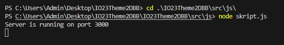

## pgAdmin4 ДБ
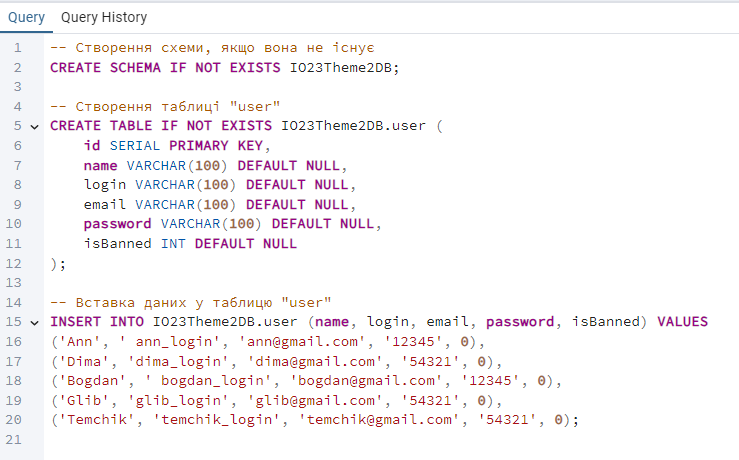

## Метод GET
### GET /
#### Запит
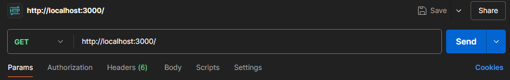
#### Відповідь
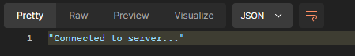

### GET /USER
#### Запит

#### Відповідь
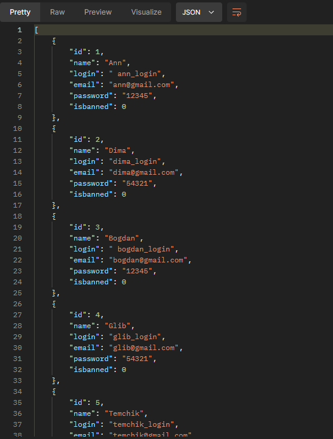

### GET /USER/:ID Існуючий користувач/Не існуючий користувач
#### Запит 

#### Відповідь
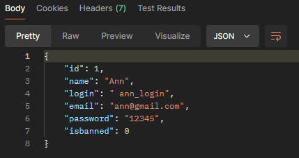

#### Запит 

#### Відповідь
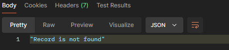

## Метод POST
#### Запит 

#### Відповідь
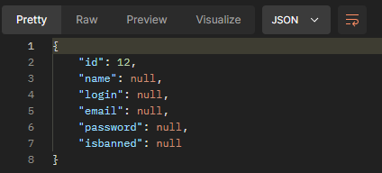

## Метод PATCH
#### Запит 
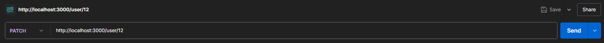
#### Відповідь
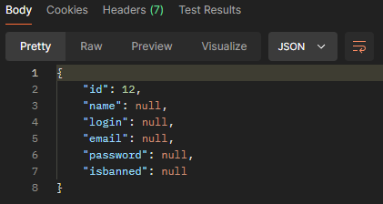

## Метод DELETE
#### Запит (виконала запит 2, щоб впевнетись чи видалився користувач)
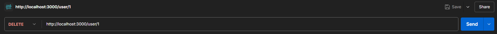
#### Відповідь
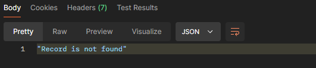

